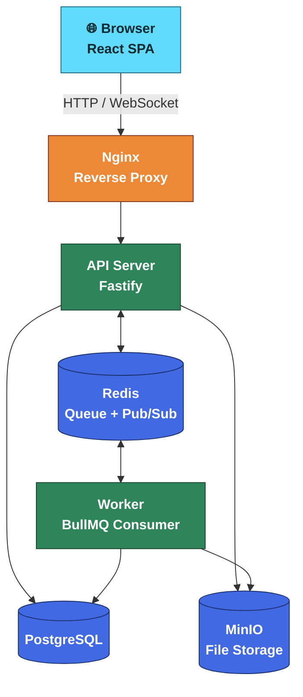
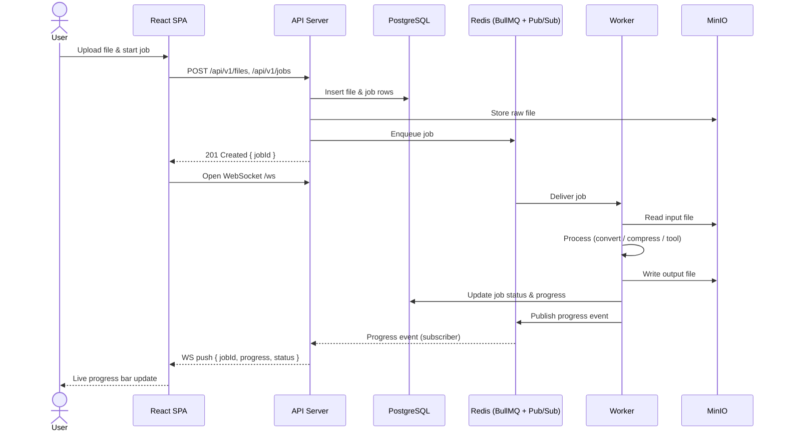

<p align="center">
  
</p>

<h1 align="center">File Processing Platform</h1>

<p align="center">
  A production-grade, full-stack file processing platform demonstrating modern engineering patterns<br/>
  across a React frontend, Fastify API, background worker, and multi-container Docker infrastructure.
</p>

<p align="center">
  
  
  
  
  
  
  
</p>

> [!NOTE]
> **Portfolio project** — built to showcase async architecture, real-time communication, and clean separation of concerns rather than business complexity.

---

## Overview

Users upload files, submit them for background processing (convert, compress, or transform), and receive live progress updates via WebSocket. The architecture mirrors real-world systems like Cloudinary, Google Drive, and document-conversion services — a stateless API tier, a decoupled worker tier, and Redis as the integration backbone between them.

**Highlights:**

- 🔐 **Authentication** — JWT access + refresh tokens, automatic silent refresh via Axios interceptor
- 📁 **File Management** — Upload, list, search, download, and soft-delete files
- ⚙️ **Background Processing** — Async job queue (BullMQ/Redis) with retry support
- 📡 **Real-Time Progress** — WebSocket push from Worker → Redis Pub/Sub → API → Browser
- 🧰 **Three Processing Pillars** — Converter, Compressor, and Tools
- 🔒 **User-scoped data** — every query is filtered by `user_id`; no cross-user data leaks

---

## Architecture



Full service boundaries, key design decisions, repository structure, and database schema are documented in [docs/architecture.md](docs/architecture.md).

---

## How It Works

An upload flows through every service in the platform before the browser sees a live progress update:



---

## Tech Stack

**Frontend**
<br/>


**API Server**
<br/>


**Worker**
<br/>


**Infrastructure**
<br/>


---

## Quick Start

**Prerequisites:** [Docker](https://docs.docker.com/get-docker/) + Docker Compose v2

```bash
git clone https://github.com/vietlvq2609/file-processing-platform.git
cd file-processing-platform
cp .env.example .env       # set JWT_ACCESS_SECRET, JWT_REFRESH_SECRET, MINIO_SECRET_KEY
docker compose up          # starts Postgres, Redis, MinIO, API, Worker, Nginx
pnpm db:seed                # creates test@example.com / password123
```

| URL | Description |
|---|---|
| `http://localhost:3000` | React SPA (via Nginx) |
| `http://localhost:3001` | API Server (direct) |
| `http://localhost:9001` | MinIO Console |

> [!TIP]
> Running services natively without Docker, the full list of available scripts, and the production build path are covered in [docs/development.md](docs/development.md) and [docs/deployment.md](docs/deployment.md).

---

## Documentation

| Document | Description |
|---|---|
| [docs/architecture.md](docs/architecture.md) | System topology, repository structure, service boundaries, and key design decisions |
| [docs/api.md](docs/api.md) | REST and WebSocket API reference |
| [docs/development.md](docs/development.md) | Local dev setup, debugging, and testing guide |
| [docs/deployment.md](docs/deployment.md) | Docker deployment and environment configuration |

---

## Contributing

See [CONTRIBUTING.md](CONTRIBUTING.md) for development workflow, coding conventions, and pull request guidelines.

---

## License

Distributed under the [MIT License](LICENSE).
