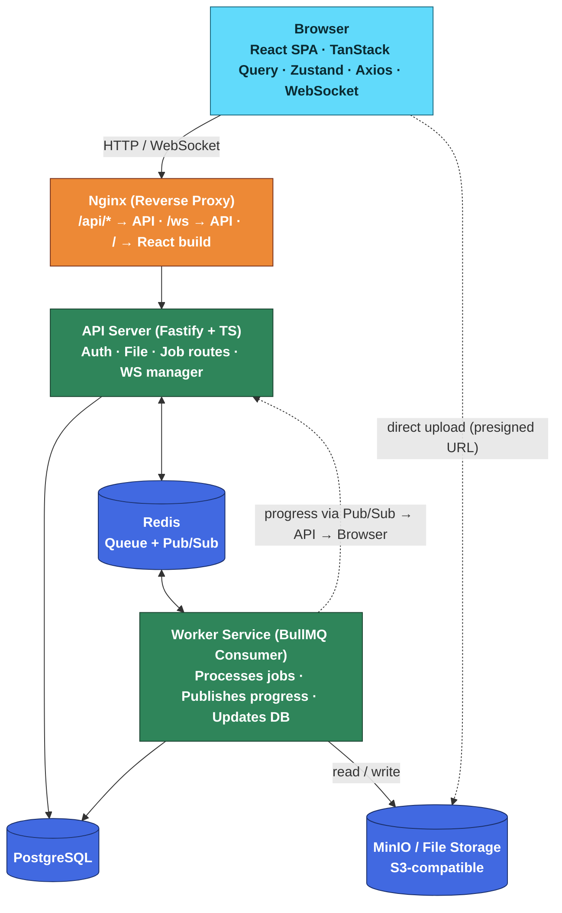
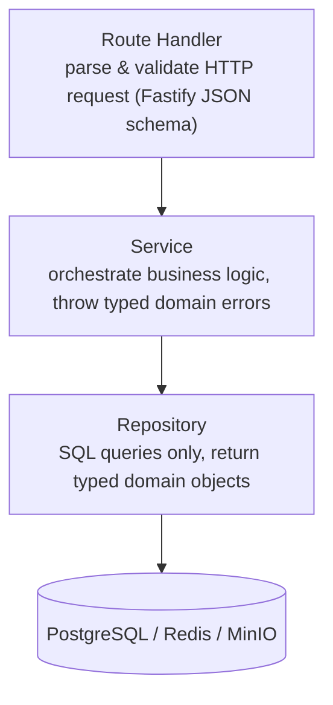
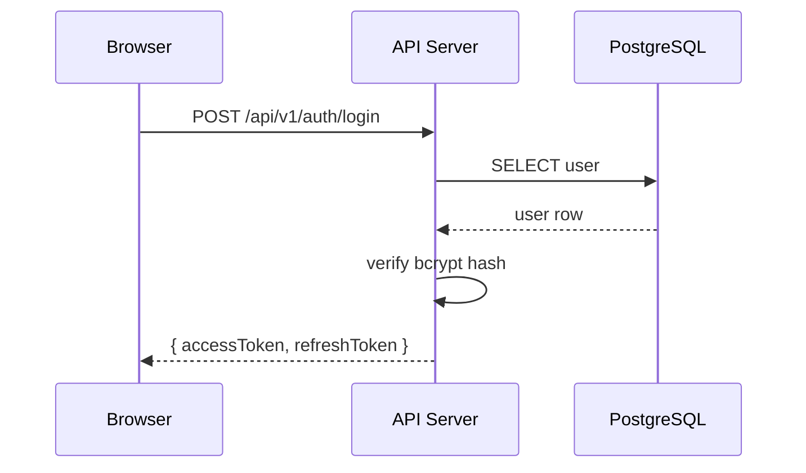
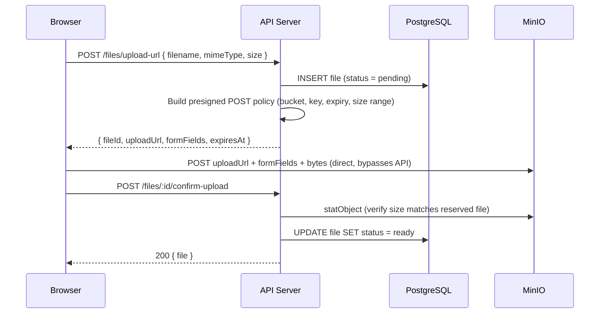
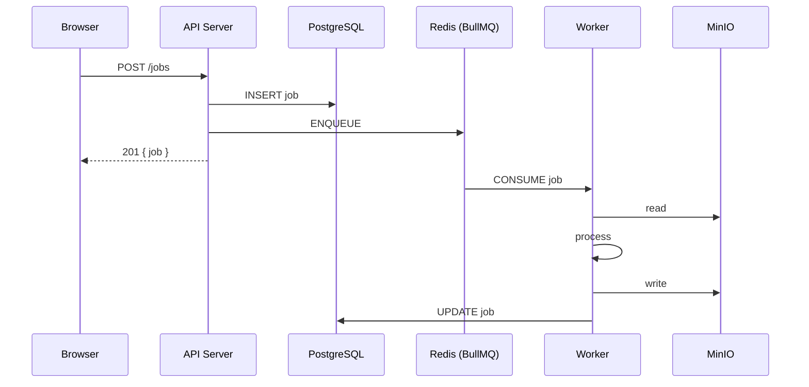
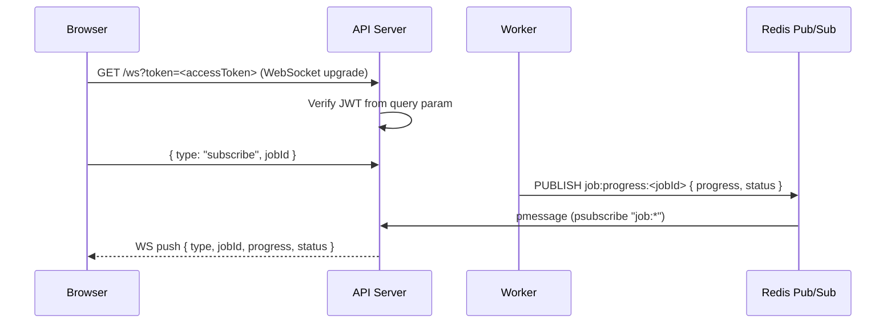
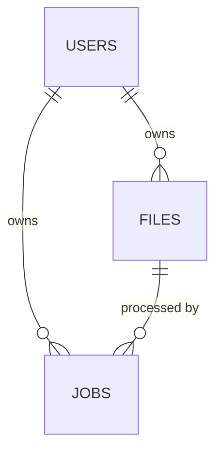
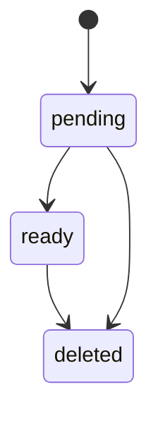
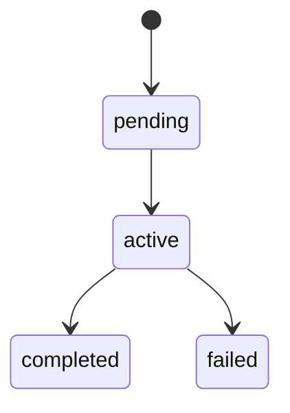

# Architecture

This document describes the system topology, service responsibilities, key design decisions, and data flows of the File Processing Platform.

---

## System Topology



---

## Repository Structure

```
file-processing-platform/
├── apps/
│   ├── api/          Fastify API server
│   ├── web/          React SPA (Vite)
│   └── worker/       BullMQ worker service
├── packages/
│   ├── db/           Drizzle schema, migrations, repositories, db client
│   └── types/        Shared TypeScript domain types and API contracts
├── infra/
│   ├── docker/       Dockerfiles and entrypoint scripts
│   ├── nginx/        Nginx reverse-proxy config
│   └── postgres/     DB init scripts and dev seed data
├── docs/             Architecture, API reference, and deployment guides
├── .env.example      Required environment variables (copy to .env)
├── docker-compose.yml         Local development (hot reload, volume mounts)
└── docker-compose.build.yml   Production-like build
```

---

## Service Boundaries

| Service | Responsibility | Communicates With |
|---|---|---|
| **Frontend** | UI, user interaction, real-time display | API Server (HTTP + WS) |
| **Nginx** | Reverse proxy, static serving | Frontend build, API Server |
| **API Server** | Auth, REST endpoints, WebSocket hub, job dispatch | PostgreSQL, Redis, MinIO |
| **Worker** | Job consumption, file processing, progress events | Redis (BullMQ), PostgreSQL, MinIO |
| **PostgreSQL** | Persistent relational data (users, files, jobs) | API Server, Worker |
| **Redis** | Job queue transport + Pub/Sub for WebSocket events | API Server, Worker |
| **MinIO** | Raw file storage (input + processed output) | API Server (upload/download), Worker (read/write) |

---

## Key Design Decisions

### Separate API and Worker containers

The API Server and Worker run as separate Docker containers. This isolates CPU/IO-intensive file processing from HTTP request handling and allows each service to scale independently.

### Redis as the integration backbone

Redis serves two purposes:

1. **Job queue** (via BullMQ) — the API Server enqueues jobs; the Worker dequeues and processes them
2. **Progress event bus** (via Pub/Sub) — the Worker publishes progress updates to a Redis channel; the API Server subscribes and pushes them to WebSocket clients

This keeps the Worker completely decoupled from WebSocket connections.

### WebSocket managed by API Server

The API Server owns all WebSocket connections. Workers never hold open connections to the browser. This is the standard pattern for horizontally scaled systems: multiple API instances all subscribe to Redis Pub/Sub, so any instance can push to any client.

### JWT with short-lived access tokens

Access tokens expire in 15 minutes. The Axios interceptor catches `401` responses, silently calls `/auth/refresh`, and retries the original request. Refresh tokens are stored in httpOnly cookies and last 7 days.

### File storage abstraction

File I/O is handled through a storage abstraction. The current implementation uses MinIO (S3-compatible). Swapping to AWS S3 requires only a configuration change — no application code changes.

### Drizzle ORM with repository layer

All database access goes through repository classes in `packages/db/src/repositories/`. Services never call the database directly. This centralises query logic and makes services unit-testable with stub repositories.

### Presigned uploads bypass the API server

File bytes are never streamed through the API. `FileService.createUploadUrl` reserves a `pending` file row and returns a MinIO presigned POST policy; the browser uploads directly to MinIO. The API only touches the object once, in `confirmUpload`, to `statObject` and verify its size before flipping the row to `ready`. This keeps the API server's request handling stateless and cheap regardless of file size, at the cost of a short window where a file row exists with no confirmed object behind it — handled by the abandoned-upload cleanup sweep (see Data Flows below).

---

## Backend Layer Responsibilities



---

## Data Flows

### 1. Authentication



- Access token: short-lived JWT (15 min), stored in Zustand memory store
- Refresh token: longer-lived JWT (7 days), stored in httpOnly cookie

### 2. File Upload (Presigned)



The API never receives file bytes — it only issues the presigned policy and later verifies the object landed correctly.

### 3. Abandoned Upload Cleanup

```mermaid
sequenceDiagram
    participant W as Worker (interval sweep)
    participant DB as PostgreSQL
    participant S as MinIO

    loop Every cleanupIntervalSeconds
        W->>DB: Find files WHERE status = pending AND created_at < now() - ttlSeconds
        DB-->>W: expired pending files
        W->>S: removeObject (best-effort; object may not exist)
        W->>DB: UPDATE file SET status = deleted
    end
```

Runs on a plain interval timer in the Worker process, independent of BullMQ. Cleans up file rows whose presigned upload was abandoned or never confirmed, so they don't linger as orphaned `pending` records.

### 4. Job Submission and Processing



### 5. Real-Time Progress



---

## Database Schema

### Entity Relationships



### Core Tables

**users**

| Column | Type | Notes |
|---|---|---|
| `id` | UUID PK | `gen_random_uuid()` |
| `email` | text unique | |
| `password_hash` | text | bcrypt |
| `created_at` | timestamptz | |
| `updated_at` | timestamptz | |
| `deleted_at` | timestamptz | soft delete |

**files**

| Column | Type | Notes |
|---|---|---|
| `id` | UUID PK | |
| `user_id` | UUID FK → users | |
| `original_name` | text | original filename from upload |
| `mime_type` | text | |
| `size` | bigint | bytes |
| `storage_path` | text | internal storage key, never exposed |
| `status` | text | `pending` \| `ready` \| `deleted` |
| `created_at` | timestamptz | |
| `deleted_at` | timestamptz | soft delete |

**jobs**

| Column | Type | Notes |
|---|---|---|
| `id` | UUID PK | |
| `user_id` | UUID FK → users | |
| `file_id` | UUID FK → files | |
| `job_type` | text | processing type enum |
| `status` | text | `pending` \| `active` \| `completed` \| `failed` |
| `progress` | integer | 0–100 |
| `output_path` | text | storage key of processed result |
| `error` | text | error message if failed |
| `created_at` | timestamptz | |
| `started_at` | timestamptz | |
| `completed_at` | timestamptz | |

### Status State Machines

**File status:**


**Job status:**


---

## Scalability Notes

- **Workers** are stateless and can be horizontally scaled — BullMQ uses Redis locks to ensure each job is processed exactly once
- **API Server** is stateless for HTTP (JWT is self-verifying) — multiple instances can run behind a load balancer
- **WebSocket** scaling works with the Redis Pub/Sub approach: every API instance subscribes to all channels and can push to any connected client
- **File storage** is abstracted — switching from MinIO to AWS S3 requires only a configuration change
